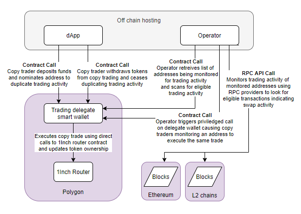

# Hackathon project DegenCopy

## Description 

This repository contains the project developed during the ETH Global Lisbon 2023 hackathon. DegenCopy is a proof of concept for a trustless permissionless on-chain copy trading protocol.

Copy trading already exists on CEXs - users deligate a portion of their funds to an operator who will add their liquidity to a pool used to copy an existing trading strategy. In this hackathon we tried to see what a simple PoC to achieve the same thing on chain might look like.

## Features
* Feature 1: Users can deposit any amount of funds and nominate an address to copy trade
* Feature 2: Off-chain operator monitors for nominated address trading and triggers trades automatically 
* Feature 3: No user interaction needed for copy trading, however funds are still stored self-custodially, openly and are always available for withdrawal

## Technologies Used
* Solidity for smart contract development
* Python and web3.py for Operator
* Polygon PoS chain
* Infura API for RPC and Etherscan API for obtained contract ABIs

## Design

The project has three components: 

1. simple React based front end enabling users to deposit funds into the contract and nominate an address to follow as well as withdrawing
2. a smart contract wallet holding deligated funds self custodially allowing for automated swapping
3. python based Operator service which scans for eligible transactions and triggers swaps on the contract

How an overview of how the components interact together see the diagram below.

## Contributing

PRs are welcome, however the this was a PoC project done in a short time frame to explore a concept. As such it will not be actively developed.

## License

This project is licensed under the [License Name]. See the LICENSE file for more information.

## Authors
* https://github.com/Jannikio/ETHLisbon-Submission
* https://github.com/zkitty-norika/devenmove-fe
* https://github.com/Jannikio/contract

## Acknowledgments
We would like to acknowledge the help of the 1inch team, the organisers of ETH Global event and the entire crypto community. 
